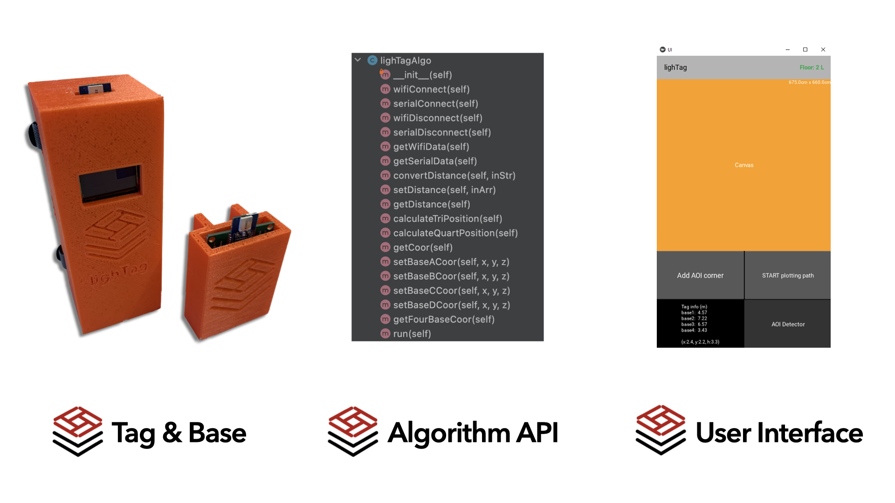
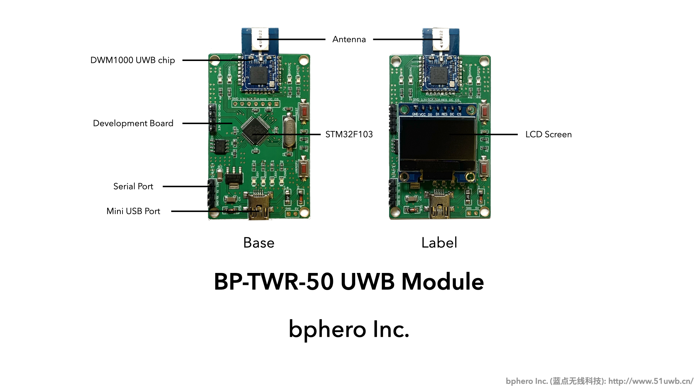
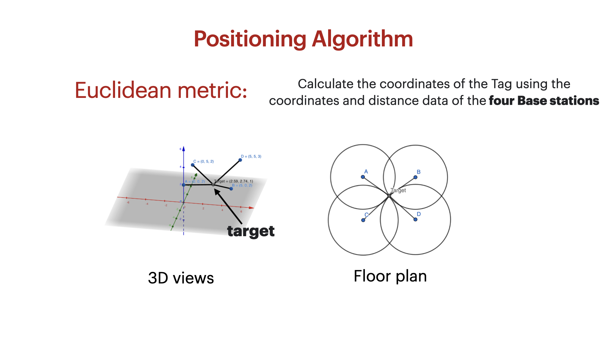
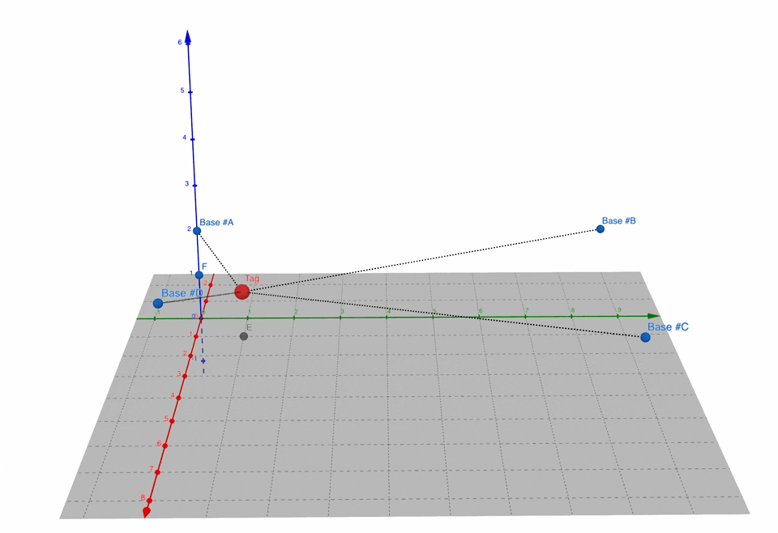
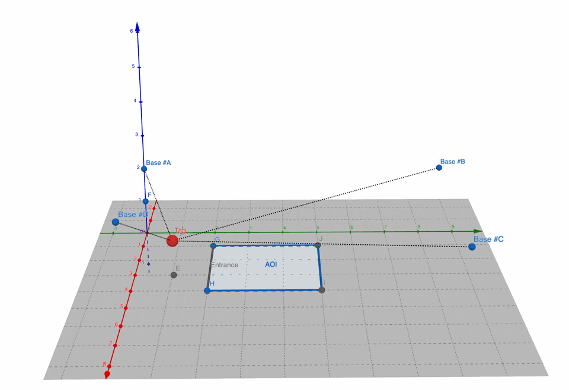
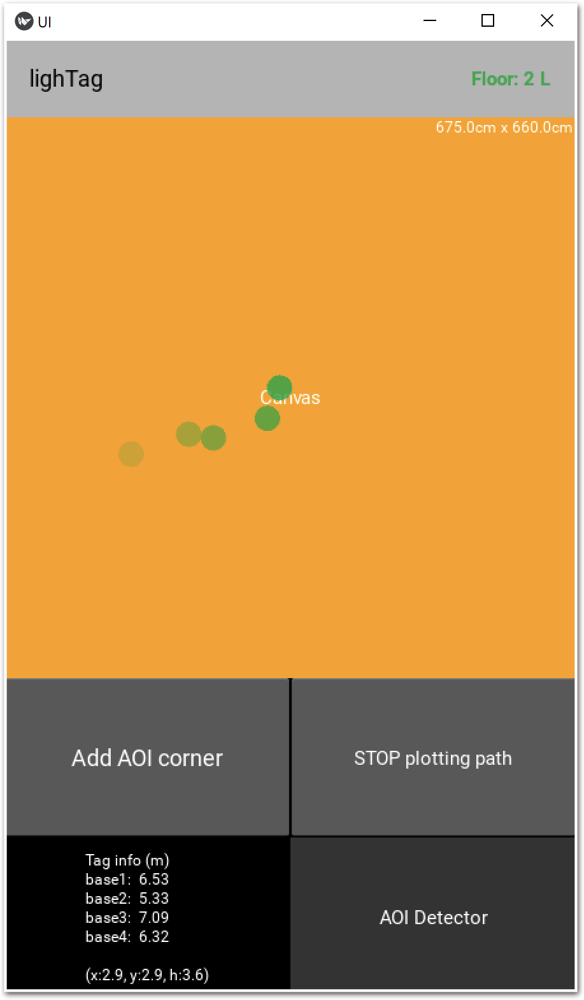
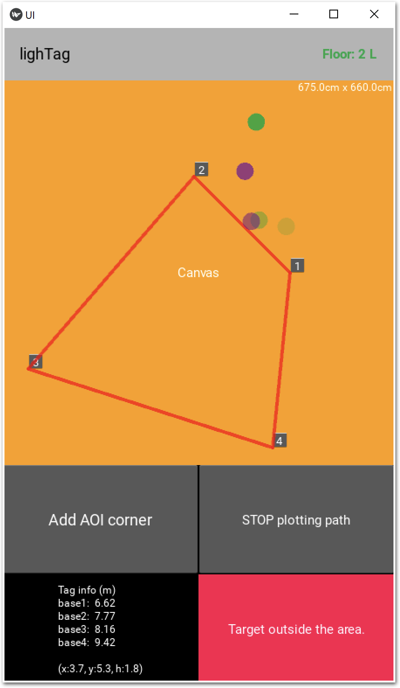
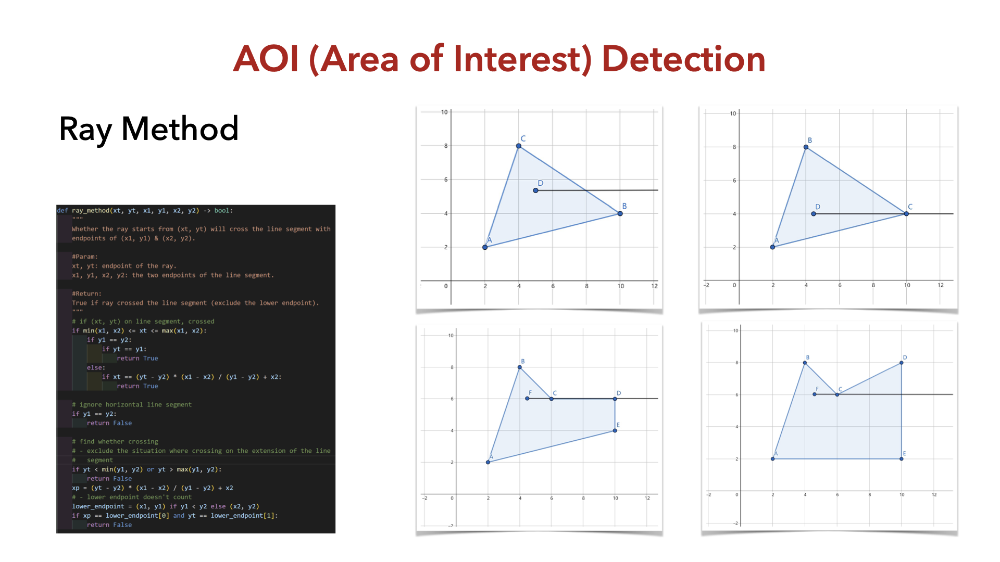

# lighTag UWB Project
**lighTag: A UWB Positioning System Integrated in Lighting System and its Applications**

<html>

</img>

</img>

</html>

---

A project supported by [MIT Hong Kong Innovation Node](https://hkinnovationnode.mit.edu/) and [The Hong Kong Polytechnic University](https://www.polyu.edu.hk/),

made by [Haley Kwok](https://github.com/HaleyKwok), [Mike Zhang](https://github.com/zhangwengyu999) and [Xavier Pan](https://github.com/X3vvv).

This project mainly focused on the research of the Ultra-wideband (UWB) technology and Internet of Things as well as their applications.

15 July, 2022

---

# Problem Statements
- Users cannot easily find their place in a multi-storey mall;
- Visitor recording during Covid-19 is not smart and detailed;
- It is not smart to turn off surplus and excessive lighting along the corridors due to the photocell sensors or occupancy sensors can only detect movement rather than people.

---

# lighTag Features
- **Solution to Power Issue**: 
  - lighTag integrated with lighting system in the building, UWB bases can receive continuous power;
- **3D Indoor Positioning**: 
  - with 4 lighTag Base Station, lighTag can get the x,y and z coordinates of the lighTag Tag integrated in user's devices;
- **High Accuracy**: 
  - lighTag has 5cm ranging accuracy, 10cm 2D accuracy, and 20cm 3D accuracy, which provides an accurate user position;
- **Area of Interest Detection**:
  - lighTag can detect the presence of user in a specific area inside the building.

---

# Project Contents

<html>

</img>

</html>

## 1. Tag & Base

<html>
<table>
  <tr>
    <td>
    

    </img>
     
    Tag | Base
    

    </td>
    <td>
    

    </img>
     
    Sub Base | Main Base
    

    </td>
</table>

</img>

</html>

- Using the BP-TWR-50 UWB Module from [bphero Inc.](http://www.51uwb.cn/) with Two Way Ranging (TWR) distancing algorithm. Based on the [TWR open source firmware from bphero](https://bitbucket.org/tuzhuke/51base_twr_f1/src/master/), we set 4 base stations for the 3D positioning. ESP8266-01S WI-FI Module is used to do the communication between UWB module and the PC via TCP/IP, which sends the distance data from base station to backend program;

---

## 2. Algorithm API

<html>

</img>

<table>
  <tr>
    <td>
    

    </img>
     
    Moving Demo
    

    </td>
    <td>
    

    </img>
     
    AOI Detection Demo
    

    </td>
</table>
</html>

- Using Python to implement the Multilateration Positioning Algorithm, which calculates the coordinates from distance data. The Python library sympy and numpy are used to solve the Euclidean metric to get the coordinates. After the algorithm optimisation, we packaged all functions into Python API for further UI usage;
- Source code: [./backend.py](./backend.py)

---

## 3. User Interface

<html>
<table>
  <tr>
    <td>
    

    </img>
     
    Plotting of user's position
    

    </td>
    <td>
    

    </img>
     
    AOI detection
    

    </td>
</table>
</html>

- The UI is implemented by the Python's Kivy library. The lighTag UI can do the real-time plotting of user's position, add Area of Interest (AOI) area by the administrator, as well as detect whether user is in the area or not. The Kivy UI can be further packaged into mobile App. The AOI detection is realized by the optimized Ray Method.
- Source code: [./ui.py](./ui.py)

<html>

</img>

</html>

---

# Applications to Problem Statements
- lighTag can enable 3D Indoor Navigation in shopping mall, airport, and factory with floor number indicated;
- Working with LeaveHomeSafe App, lighTag can automatically record arrival & leaving, record detailed location information, and measure social distance;
- lighTag can adjust indoor lights status including ON/OFF and brightness, based on the position and number of people.

---

Copyright © [The Hong Kong Polytechnic University](https://www.polyu.edu.hk/), [MIT Hong Kong Innovation Node](https://hkinnovationnode.mit.edu/), [Haley Kwok](https://github.com/HaleyKwok), [Mike Zhang](https://github.com/zhangwengyu999), [Xavier Pan](https://github.com/X3vvv)  All rights reserved.
